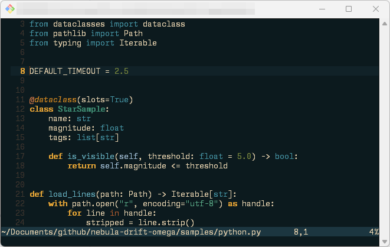
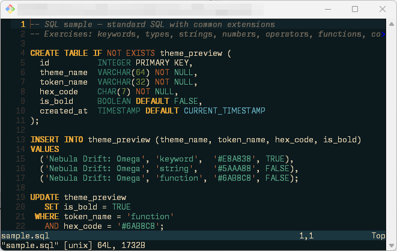

# 🦢 Nebula Drift: Omega — A Vim Colour Scheme

> *"The Omega Nebula (M17), a swan-shaped stellar nursery in Sagittarius, about 5,500 light-years away."*

A Vim colour scheme drawn from the cosmic palette of the **Omega Nebula** (M17 / Swan Nebula).
Deep teal-black void, warm amber gas pillars, jade nebula wisps, cream starlight edges, and
blue-white stellar highlights — all at your fingertips.

---

## Screenshot




---

## Palette

| Name             | Hex       | Used For                          |
|------------------|-----------|-----------------------------------|
| Omega Void       | `#0C1A1E` | Background                        |
| Warm Starlight   | `#EEDCB8` | Primary text                      |
| Blue-White Star  | `#A8C8E0` | Variables, identifiers            |
| Comment Smoke    | `#7A7060` | Comments                          |
| Corona Amber     | `#E8A838` | Keywords, statements              |
| Pillar Amber     | `#D48820` | Labels, secondary keywords        |
| Jade Gas         | `#5AAA88` | Strings                           |
| Deep Jade        | `#3E8870` | Types, classes                    |
| Bright Teal Star | `#6AB8C8` | Functions, methods                |
| Nebula Ice       | `#4898A8` | Includes, links, directories      |
| Burnt Sienna     | `#B86030` | Operators                         |
| Copper Flame     | `#D07848` | Special chars, macros, decorators |
| Olive Haze       | `#788840` | Constants, numbers                |
| Bright Olive     | `#909858` | Booleans                          |
| Rose Ember       | `#C86858` | Errors                            |
| Warning Gold     | `#C89840` | Warnings                          |

---

## Installation

### [vim-plug](https://github.com/junegunn/vim-plug)

```vim
Plug 'ikelaiah/nebula-drift-omega'
```

Then in your `.vimrc`:

```vim
colorscheme nebula-drift-omega
```

### [Packer.nvim](https://github.com/wbthomason/packer.nvim)

```lua
use 'ikelaiah/nebula-drift-omega'
```

### [Lazy.nvim](https://github.com/folke/lazy.nvim)

```lua
{ 'ikelaiah/nebula-drift-omega' }
```

### Manual

Copy `colors/nebula-drift-omega.vim` into your `~/.vim/colors/` directory (or
`~\vimfiles\colors\` on Windows) and add to your `.vimrc`:

```vim
colorscheme nebula-drift-omega
```

---

## Requirements

- Vim 7.0+ or Neovim
- A terminal with 256-colour support (for best results, a true-colour terminal with `set termguicolors`)

For the richest rendering of the nebula's hues, add this to your `.vimrc`:

```vim
set termguicolors
```

> **Note on 256-colour terminals:** This scheme uses only GUI (`guifg`/`guibg`) colour values and does not set `ctermfg`/`ctermbg` fallbacks. A true-colour terminal with `set termguicolors` is required for the palette to render correctly.
>
> **Note on `background`:** `Nebula Drift: Omega` currently sets `background=dark` when the theme loads (see `colors/nebula-drift-omega.vim`). The file contains a light variant ("The Stellar Dawn"), but the distributed scheme defaults to the dark variant unless you modify the theme source.

---

## Features

- Full syntax highlighting coverage for all standard Vim groups
- Supports GitGutter / Signify-style signs
- Diff colours
- Spell-check highlighting
- Diagnostic highlights (including undercurls)
- Plugin highlights for Fugitive, CoC, fzf, vim-indent-guides, and vim-illuminate
- Neovim terminal colour palette (`g:terminal_color_*`)

### Language Support

Dedicated, language-specific highlight groups for:

| Language | Language | Language |
|---|---|---|
| SQL | Python | JavaScript |
| TypeScript | PHP | HTML |
| CSS | SCSS / SASS | C |
| C++ | Java | Rust |
| Go | Bash / Shell | PowerShell |
| Pascal / Delphi | LISP | Scheme |
| Racket | JSON | YAML |
| Lua | INI / config | Markdown |
| Vim script |  |  |

All other languages fall back gracefully to the universal highlight groups.

> **Note on user-defined type names:** Vim's built-in syntax engine does not reliably distinguish between user-defined class/struct names and regular identifiers in many languages. Built-in types are coloured correctly, but full semantic separation of user-defined types typically requires an LSP-based plugin (e.g. `nvim-lsp` or `coc.nvim`), which is intentionally outside the scope of this scheme.

---

## Inspiration

The palette was extracted from imagery of the **Omega Nebula (M17 / Swan Nebula)**, a stellar
region approximately **5,500 light-years** from Earth in the constellation **Sagittarius**.
Its teal shadow folds, amber gas pillars, jade wisps, and bright starlight edges make for a
striking yet readable dark theme.

---

## License

MIT — free as starlight, open as the cosmos.
